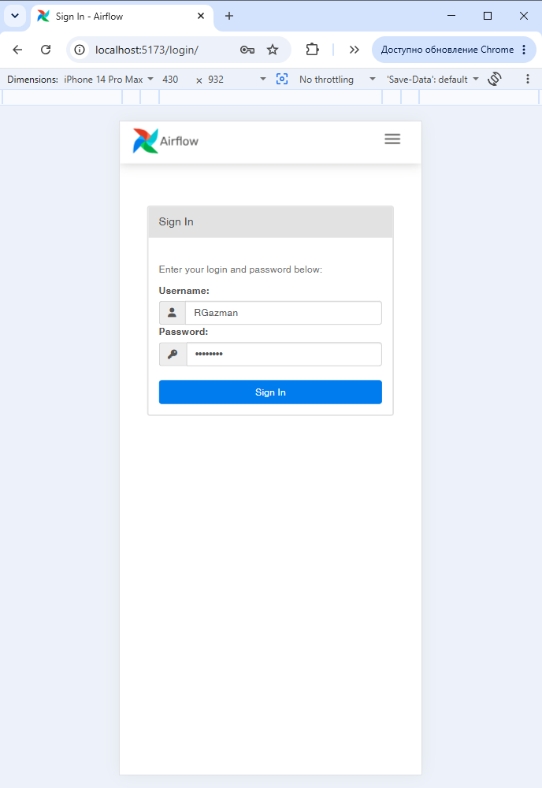
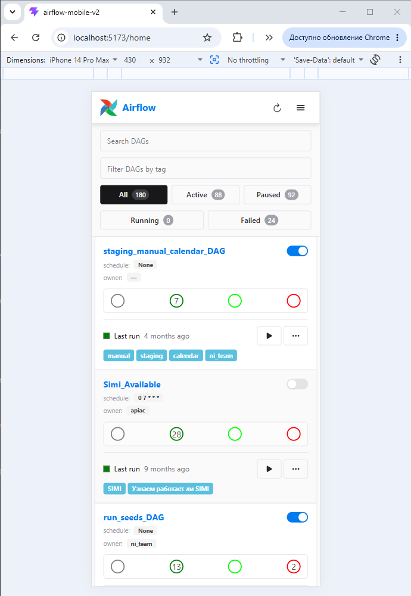
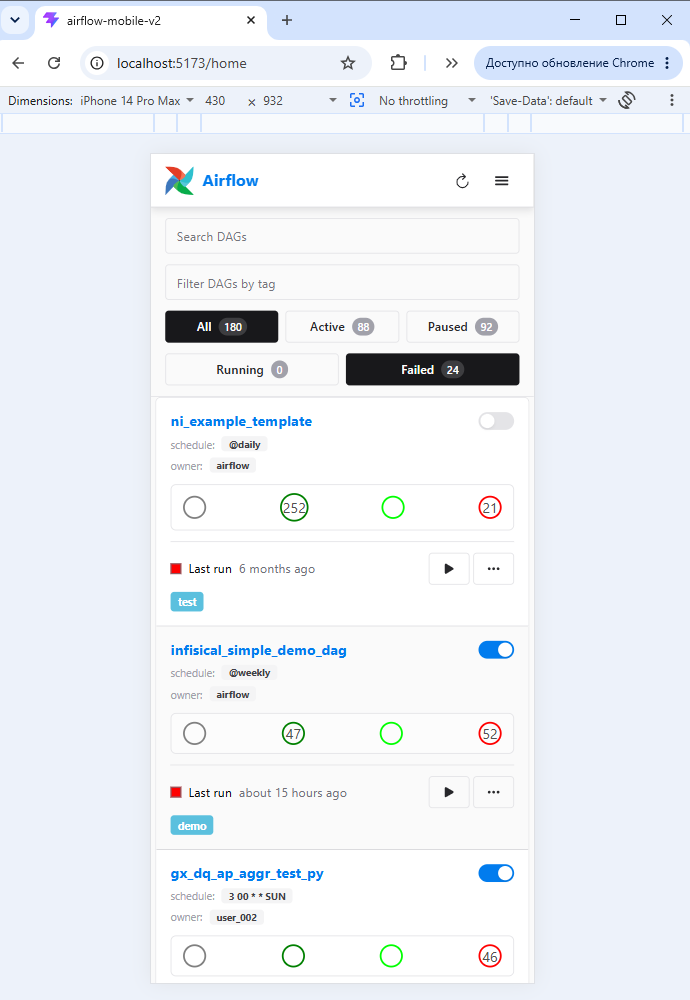
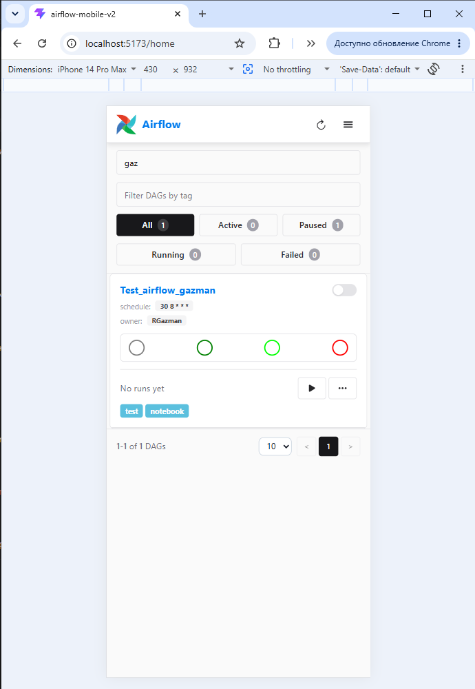
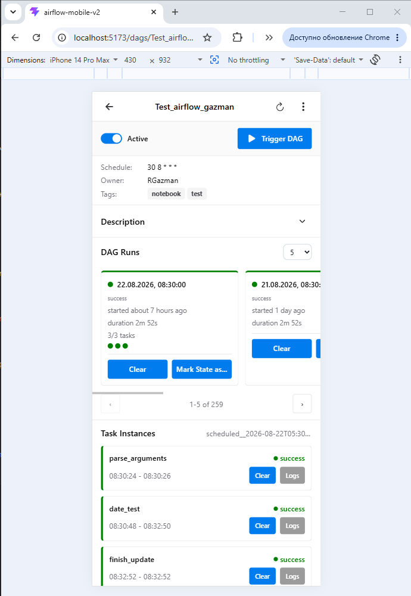
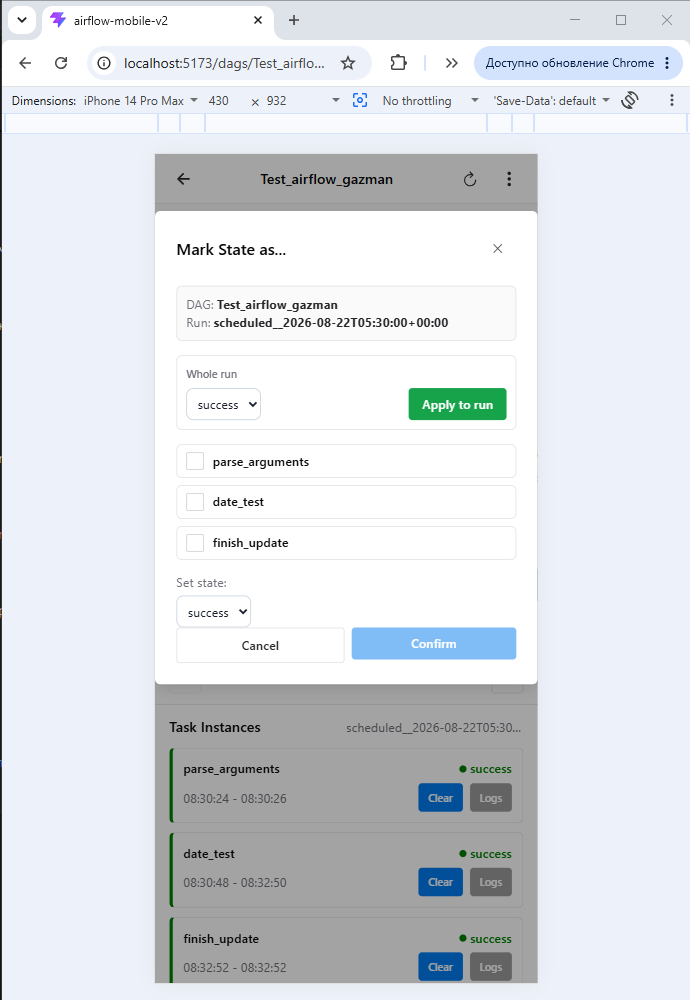
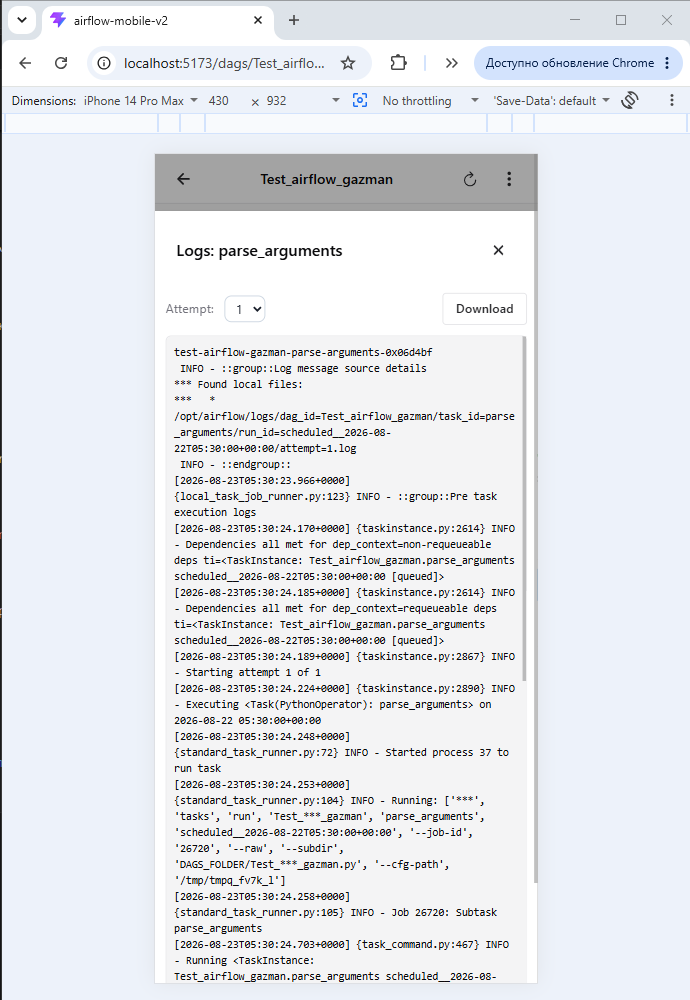
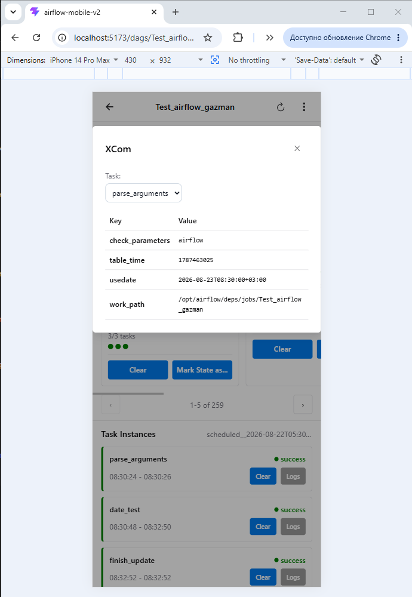

# Airflow Mobile UI v2

> 🇬🇧 **English** · [🇷🇺 Русская версия](README.md)

An unofficial mobile web UI for **Apache Airflow 2.10.5**.

> **Why «v2»?** The project is inspired by, but does not continue, [astronomer/airflow-ui](https://github.com/astronomer/airflow-ui) — a React proof-of-concept UI that was archived by its owner on May 15, 2026. v2 is an independent, from-scratch implementation aimed at mobile devices; the «v2» suffix merely distinguishes the repository from that archived project.

## About

Fast access to Airflow from a phone or tablet: monitoring DAGs and runs, changing their states, logs and XCom.

A separate instance on top of the **REST API v1**; where REST mutations don't work in the target installation — Airflow's internal web forms with a CSRF token. Authentication goes through the proxied Airflow login form.



> Developed and tested strictly against **Apache Airflow 2.10.5**. No guarantees with other versions.

## Tech

| Tech | Version | Why |
|---|---|---|
| React + TypeScript | 19.x, 6.0 strict | component UI, typing |
| Vite | 8.x | build and dev proxy to Airflow |
| Chakra UI | 3.x | adaptive components |
| TanStack Query | 5.x | cache, invalidations, keepPreviousData |
| React Router | 7.x | routes |
| axios, date-fns, react-hook-form + zod, ESLint | — | HTTP, dates, forms/validation, style |

## Features

**DAG list** — cards: name, schedule, owner, tags, pause, stats, last-run dot. Search, filters All/Active/Paused/Running/Failed, pagination. Latest run via one `POST /last_dagruns`.







**DAG detail** — description, meta, Trigger DAG (JSON), Runs list (Clear run, Mark state as, Apply to run).



**Mark state as...** — task selection: adjacent tasks as one `downstream=true` chain, separated tasks via their own POSTs; a "Whole run" block changes the whole run state.



**Task instances** — in flow order, subdag groups, Clear, Logs (attempt picker), XCom.





## Run locally

Minimum: **Node.js 20.19+** (22 LTS recommended), **npm 10+**, an accessible **Apache Airflow 2.10.5** with an account.

```bash
npm install
cp .env.example .env     # fill VITE_AIRFLOW_API_URL
npm run dev              # http://localhost:5173
```

Checks: `npm run build`, `npm run lint`.

`.env` (see `.env.example`): `VITE_AIRFLOW_API_URL` — instance URL; `VITE_AIRFLOW_API_PREFIX` — API prefix (defaults to `/api/v1`).

Production: static files from `dist/` behind a reverse proxy (nginx) that proxies `/api`, `/clear`, `/success`, `/failed`, `/confirm`, `/dagrun_*`, `/last_dagruns`, `/object`, `/static`, `/login`, `/logout` to Airflow.

## Deployment (Docker / Kubernetes)

- `Dockerfile` — dev image (Vite dev server): the Airflow config is injected at runtime via env (`VITE_AIRFLOW_API_URL`, `VITE_AIRFLOW_API_PREFIX`, `VITE_ALLOWED_HOSTS`) — no rebuild when switching instances.
- `k8s/` — example manifests (kustomize): configmap, deployment, service, ingress. Hosts, registry and namespace are placeholders — replace with your own.
- Behind an ingress: `VITE_ALLOWED_HOSTS` = frontend domain (otherwise Vite rejects requests), redirects keep https, `X-Forwarded-*` are stripped on the way to Airflow.
- SSO (Keycloak/OIDC): `AIRFLOW__WEBSERVER__BASE_URL` = public Airflow URL, callback registered in the IdP, session cookie `SameSite=Lax`.

## Unstable web endpoints

Actions go through internal endpoints (not REST v1): `POST /clear|/success|/failed` (form CSRF), `GET /confirm` (preview), `POST /dagrun_success|/dagrun_failed`, `POST /last_dagruns` (`X-CSRFToken` header), `GET /object/graph_data`, `GET /dags/{id}/grid` (CSRF). They are **not stable** across Airflow versions — re-check before upgrading.

## License

[GNU AGPL-3.0-only](LICENSE) — see also [NOTICE](NOTICE). Modifications and network use (AGPL §13) require publishing the source code under the same license.

This project is an unofficial client for Apache Airflow™ and is not affiliated with the Apache Software Foundation. Airflow™ and its logo are trademarks of the ASF.
